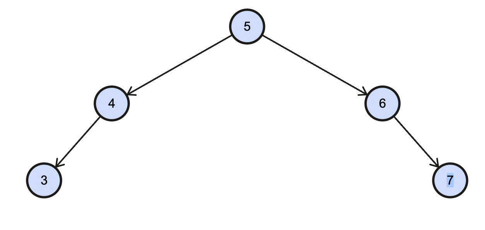

[98. Validate Binary Search Tree](https://leetcode.com/problems/validate-binary-search-tree/)

- 기본적인 DFS
  - try1 submit실패
  - [5,4,6,null,null,3,7]의 경우 false가 되야함
    - 
    - 그러나 내가 작성한 코드는 5의 left : 4, right : 6. 6의 left : 4, right : 7로 되버려서 true